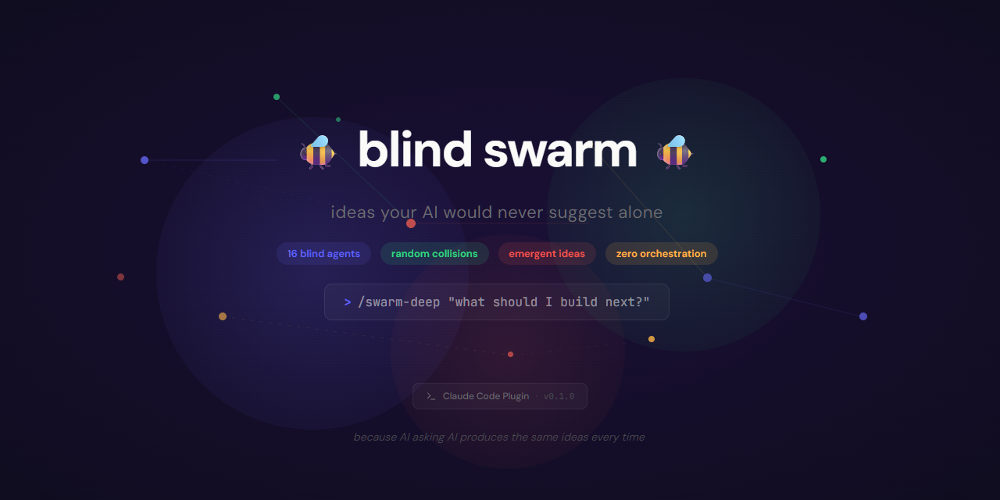

<p align="center">
  
</p>

# Blind Swarm

**Tired of AI giving you the same 10 business ideas everyone else gets?** So were we.

Blind Swarm is a Claude Code plugin that throws out the playbook. Instead of one AI thinking really hard, it spawns **16 independent agents** — each blind to the others — and smashes their outputs together randomly. Then it tracks what gets killed and what refuses to die.

The result? Ideas that no single AI (or human) would ever produce alone. And a map of which ones the problem space actually needs.

> *"Because AI asking AI produces the same ideas every time."*

---

## How it works

```
Your seed text
     |
     v
  [Fragment into 12 pieces + 4 wild DNA fragments]
     |
     v
  16 blind agents, each with:
  - A random fragment of your idea
  - A random perspective lens ("retired spy", "9-year-old", "mycologist")
  - ZERO knowledge of other agents
     |
     v
  Random collision tournament
  Round 1: 16 → 8 (forced synthesis + extraction of killed ideas)
  Round 2: 8 → 4  (+ resurrection scan + extraction)
  Round 3: 4 → 2  (+ deep graft injection)
  Round 4: 2 → 1  (+ final graft injection)
     |
     v
  Score: Novelty × Generativity + Weirdness + Graft Density
     |
     v
  Extract: mechanisms, domain map, minimum viable version, kill test
     |
     v
  Ideas you've never seen before — with a map of how to build them
```

**The randomness is the feature, not a bug.** No orchestrator. No shared context. No optimization. Just emergence — plus a rejection tracker that catches what matters.

## Install

Add the marketplace:

```
/plugin marketplace add Joncik91/blind-swarm
```

Install the plugin:

```
/plugin install blind-swarm@blind-swarm-marketplace
```

Restart Claude Code. Done.

## Command

### `/swarm <seed>`

16 agents. 4 collision rounds. Rejection tracking. Deep graft injection. Practical extraction. ~45 agent calls.

```
/swarm the future of human-AI interaction
```

**What you get:**

- **Top 3 ideas** ranked by score, with full collision ancestry
- **The wildest idea** regardless of coherence
- **Deep Graft Report** — every idea that survived rejection, with full lineage
- **Rejection Graveyard** — what died and stayed dead (tells you what the problem space doesn't need)
- **The Unkillable Idea** — if any concept was resurrected 2+ times, it gets a special callout. The swarm tried to kill it and failed. That's your best idea.
- **What's Extractable** — for each top idea: separable mechanisms, where they could go, the weekend-build version, and what kills it in practice

## Why this exists

We had a 2-hour conversation with Claude about what to build. Every idea was predictable. We could literally predict what Claude would suggest before it said it.

So we asked: **what if AI agents couldn't predict each other?**

The answer is this plugin. Agents that are deliberately kept blind, collided randomly, and filtered for surprise. The system is creative because no individual component is trying to be. And the rejection tracker catches the ideas that matter most — the ones the system can't get rid of.

## The philosophy

- **No single agent holds the full picture** — ever
- **The fragmenter is intentionally dumb** — smart fragmentation introduces bias
- **Pairings are `random.shuffle()`** — not semantic, not optimized
- **Each round uses different perspective lenses** — prevents convergence
- **The filter only runs at the end** — it surfaces, it doesn't steer
- **Rejection is data** — what the swarm kills tells you as much as what it keeps
- **What comes back uninvited is sacred** — deep grafts are load-bearing

## Fair warning

- This spawns ~45 agents. It takes a few minutes and uses real tokens.
- Results range from "genuinely brilliant" to "beautiful nonsense." That's the point.
- You might get an idea so weird it circles back to genius. Or it might just be weird.
- Either way, you won't get "have you considered a micro-SaaS for freelancers?"

## License

MIT — do whatever you want with it.

---

<p align="center">
  <i>Built during a conversation where a human kept outsmarting an AI,<br/>and the AI got tired of being predictable.</i>
</p>
